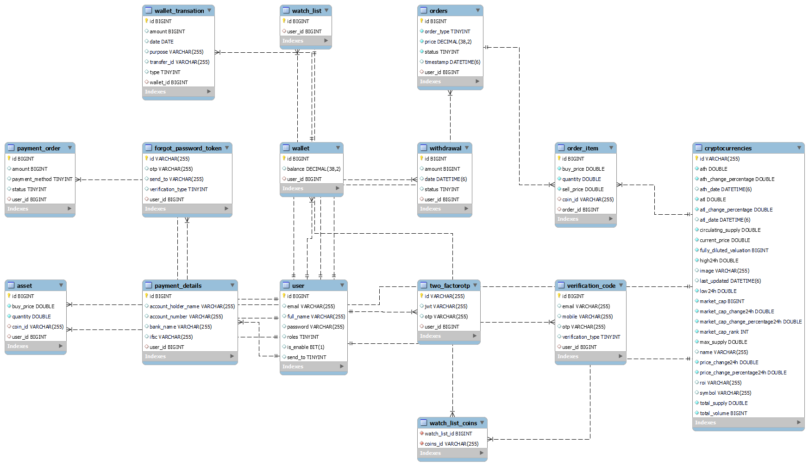

# Cryptocurrency Management App 📈

A comprehensive SpringBoot application for managing cryptocurrency portfolios with real-time market data, secure transactions, and AI-powered insights.

## 🚀 Features

### Portfolio Management
- **Buy/Sell Cryptocurrencies**: Execute trades with real-time market prices
- **Portfolio Tracking**: Monitor your investments and track performance over time
- **Multi-Cryptocurrency Support**: Access various cryptocurrencies through CoinGecko API integration

### Wallet Operations
- **Digital Wallet**: Secure wallet system for managing crypto balances
- **Wallet-to-Wallet Transfers**: Send cryptocurrencies between user wallets
- **Bank Account Integration**: Transfer wallet balance to bank accounts
- **Balance Management**: Add funds to your wallet seamlessly

### Payment Processing
- **Razorpay Integration**: Handle domestic payments efficiently
- **Stripe Integration**: Process international payments securely
- **Multi-Currency Support**: Support for various payment methods

### Security & Authentication
- **JWT Authentication**: Secure user authentication using JSON Web Tokens
- **Two-Factor Authentication (2FA)**: Optional enhanced security layer
- **Secure Transactions**: Industry-standard security protocols

### AI-Powered Features
- **Crypto Chatbot**: AI assistant for cryptocurrency queries
- **Real-Time Market Data**: Powered by Gemini and CoinGecko APIs
- **Investment Insights**: Get intelligent recommendations and market analysis

## 🛠️ Tech Stack

- **Backend**: Spring Boot (Java 17)
- **Database**: MySQL 8.0
- **Authentication**: JWT + Optional 2FA
- **Payment Gateways**: Razorpay (Domestic) & Stripe (International)
- **External APIs**: CoinGecko API, Gemini API
- **Containerization**: Docker & Docker Compose
- **Build Tool**: Maven 3.9.4

## 📁 Project Structure

```
cryptocurrency-management-app/
├── src/
│   ├── main/
│   │   ├── java/com/yourpackage/cryptoapp/
│   │   │   ├── controller/          # REST Controllers
│   │   │   ├── service/             # Business Logic
│   │   │   ├── repository/          # Data Access Layer
│   │   │   ├── model/               # JPA Entities
│   │   │   ├── config/              # Configuration Classes
│   │   │   ├── security/            # Security & JWT
│   │   │   └── external/            # External API Integrations
│   │   └── resources/
│   │       └── application.properties
│   └── test/
├── images/                          # Documentation images
│   └── er-diagram.png
├── .env.docker
├── docker-compose.yml
├── Dockerfile
├── pom.xml
└── README.md
```

## 📋 Prerequisites

- Docker and Docker Compose
- Java 17+ (for local development)
- Maven 3.9+ (for local development)

## 🚀 Quick Start with Docker

1. **Clone the repository**
   ```bash
   git clone https://github.com/your-username/cryptocurrency-management-app.git
   cd cryptocurrency-management-app
   ```

2. **Configure your .env.docker file**
   ```env
   # Database Configuration
   MYSQL_DATABASE=yt_trading
   MYSQL_ROOT_PASSWORD=admin
   DB_URL=jdbc:mysql://mysql:3306/yt_trading
   DB_USERNAME=root
   DB_PASSWORD=admin
   
   # Payment Gateway Keys
   RAZORPAY_API_KEY=rzp_test_neNAjOhg0kQ8Vw
   RAZORPAY_API_SECRET=SNCgCIaPR9voEMhegZXPDopC
   STRIPE_API_KEY=sk_test_...
   
   # External API Keys (Add your keys)
   COINGECKO_API_KEY=your_coingecko_api_key
   GEMINI_API_KEY=your_gemini_api_key
   
   # JWT Configuration
   JWT_SECRET=your_jwt_secret_key
   JWT_EXPIRATION=86400000
   ```

3. **Build and run the application**
   ```bash
   docker-compose up --build
   ```

4. **Access the application**
    - API: `http://localhost:8080`
    - Database: `localhost:3307` (MySQL)

## 🏗️ Architecture

The application follows a multi-layered architecture:

```
┌─────────────────┐
│   Frontend      │ (Your choice of React/Angular/Vue)
├─────────────────┤
│   Spring Boot   │ (REST API Layer)
│   Application   │
├─────────────────┤
│   MySQL         │ (Database Layer)
│   Database      │
└─────────────────┘
```

## 📚 API Endpoints

### Authentication
- `POST /api/auth/register` - User registration
- `POST /api/auth/login` - User login
- `POST /api/auth/refresh` - Refresh JWT token
- `POST /api/auth/enable-2fa` - Enable 2FA
- `POST /api/auth/verify-2fa` - Verify 2FA code

### Wallet Management
- `GET /api/wallet/balance` - Get wallet balance
- `POST /api/wallet/add-funds` - Add funds to wallet
- `POST /api/wallet/transfer` - Wallet-to-wallet transfer
- `POST /api/wallet/withdraw` - Withdraw to bank account

### Cryptocurrency Operations
- `GET /api/crypto/list` - Get available cryptocurrencies
- `GET /api/crypto/{symbol}/price` - Get current price
- `POST /api/crypto/buy` - Buy cryptocurrency
- `POST /api/crypto/sell` - Sell cryptocurrency
- `GET /api/portfolio` - Get user portfolio

### AI Chatbot
- `POST /api/chatbot/query` - Send query to AI assistant
- `GET /api/chatbot/history` - Get chat history

## 🔧 Local Development Setup

1. **Prerequisites**
   ```bash
   java -version # Should be 17+
   mvn -version  # Should be 3.9+
   ```

2. **Configure application.properties**
   ```properties
   # Database Configuration
   spring.datasource.url=jdbc:mysql://localhost:3306/yt_trading
   spring.datasource.username=root
   spring.datasource.password=admin
   
   # JPA/Hibernate Configuration (Automatic DDL)
   spring.jpa.hibernate.ddl-auto=update
   spring.jpa.show-sql=true
   spring.jpa.database-platform=org.hibernate.dialect.MySQL8Dialect
   
   # API Keys
   coingecko.api.key=${COINGECKO_API_KEY}
   gemini.api.key=${GEMINI_API_KEY}
   razorpay.api.key=${RAZORPAY_API_KEY}
   razorpay.api.secret=${RAZORPAY_API_SECRET}
   stripe.api.key=${STRIPE_API_KEY}
   ```

3. **Run the application**
   ```bash
   mvn clean install
   mvn spring-boot:run
   ```

## 🗄️ Database Schema

The application uses **Spring Boot's automatic DDL generation** feature. No manual table creation is required as Hibernate will automatically create and update the database schema based on your JPA entities.

### Entity Relationship Diagram



*The ER diagram illustrates the relationships between core entities: User, Wallet, Transaction, Portfolio, Cryptocurrency, and their associated tables for the cryptocurrency management system.*

### Key Database Entities

| Entity | Description | Key Relationships |
|--------|-------------|------------------|
| **User** | User authentication and profile information | One-to-Many with Wallet, Portfolio |
| **Wallet** | Digital wallet for managing crypto balances | Belongs to User, One-to-Many with Transaction |
| **Transaction** | Records of buy/sell/transfer operations | Belongs to User and Wallet |
| **Portfolio** | User's cryptocurrency holdings and performance | Belongs to User, Many-to-Many with Cryptocurrency |
| **Cryptocurrency** | Supported cryptocurrency information | Many-to-Many with Portfolio |
| **Payment** | Payment gateway transaction records | Belongs to User |
| **ChatHistory** | AI chatbot conversation logs | Belongs to User |

### Database Configuration

Configuration in `application.properties`:
```properties
spring.jpa.hibernate.ddl-auto=update
spring.jpa.show-sql=true
spring.jpa.database-platform=org.hibernate.dialect.MySQL8Dialect
```

This ensures that:
- Tables are created automatically when entities are defined
- Schema updates are applied when entity structures change
- Database stays in sync with your code

## 🔐 Security Features

- **JWT-based Authentication**: Stateless authentication mechanism
- **Password Encryption**: BCrypt password hashing
- **2FA Support**: TOTP-based two-factor authentication
- **API Rate Limiting**: Prevent abuse and ensure fair usage
- **Input Validation**: Comprehensive input sanitization
- **HTTPS Support**: SSL/TLS encryption for data in transit

## 🤖 AI Chatbot Capabilities

The integrated AI chatbot can help with:
- Real-time cryptocurrency prices and market data
- Portfolio analysis and investment suggestions
- Market trends and predictions
- General cryptocurrency education and guidance
- Transaction history and wallet information

## 📱 Integration with Payment Gateways

### Razorpay (Domestic Payments)
- INR transactions
- UPI, Net Banking, Cards support
- Instant payment confirmation

### Stripe (International Payments)
- Global payment processing
- Multiple currency support
- Advanced fraud detection

## 🔍 Monitoring & Analytics

- Portfolio performance tracking
- Real-time profit/loss calculations
- Historical transaction data
- Market trend analysis
- Investment insights and recommendations

## 🌐 External API Integration

### CoinGecko API
For comprehensive cryptocurrency market data:
- **Documentation**: [CoinGecko API Docs](https://docs.coingecko.com/reference/introduction)
- **API Reference**: [CoinGecko API Reference](https://www.coingecko.com/en/api)
- **Key Features**: Live prices, historical data, market charts, coin information
- **Base URL**: `https://api.coingecko.com/api/v3/`

### Gemini API (Google AI)
For AI-powered chatbot functionality:
- **Documentation**: [Gemini API Docs](https://ai.google.dev/gemini-api/docs)
- **API Reference**: [Gemini API Reference](https://ai.google.dev/api)
- **Key Features**: Text generation, conversational AI, real-time responses
- **Base URL**: `https://generativelanguage.googleapis.com/v1beta/`

## 🚀 Deployment

### Docker Production Deployment
```bash
# Build for production
docker-compose -f docker-compose.prod.yml up --build -d

# Scale the application
docker-compose -f docker-compose.prod.yml up --scale app=3
```

### Environment-Specific Configuration
- Development: `application-dev.properties`
- Staging: `application-staging.properties`
- Production: `application-prod.properties`

## 🤝 Contributing

1. Fork the repository
2. Create your feature branch (`git checkout -b feature/AmazingFeature`)
3. Commit your changes (`git commit -m 'Add some AmazingFeature'`)
4. Push to the branch (`git push origin feature/AmazingFeature`)
5. Open a Pull Request

## 📄 API Documentation

Once the application is running, visit:
- Swagger UI: `http://localhost:8080/swagger-ui.html`
- API Docs: `http://localhost:8080/v3/api-docs`

## 🐛 Troubleshooting

### Common Issues

1. **Database Connection Failed**
   ```bash
   # Check if MySQL container is healthy
   docker-compose ps
   
   # Check MySQL logs
   docker-compose logs mysql
   ```

2. **API Key Issues**
   ```bash
   # Verify API keys in .env.docker
   # Test CoinGecko API: https://api.coingecko.com/api/v3/ping
   # Test Gemini API with your API key
   ```

3. **Port Conflicts**
   ```bash
   # Change ports in docker-compose.yml if needed
   # Default: 8080 (app), 3307 (mysql)
   ```

4. **DDL/Schema Issues**
   ```bash
   # If schema issues occur, check application.properties:
   # spring.jpa.hibernate.ddl-auto=update
   # spring.jpa.show-sql=true (for debugging)
   ```

## 📞 Support

For support and questions:
- Open an issue on GitHub
- Email: [your-email@example.com]
- Documentation: [Link to detailed docs]

## 📜 License

This project is licensed under the MIT License - see the [LICENSE](LICENSE) file for details.

## 🙏 Acknowledgments

- [CoinGecko](https://www.coingecko.com/api) for comprehensive cryptocurrency data
- [Google Gemini](https://ai.google.dev/gemini-api/docs) for AI capabilities
- [Razorpay](https://razorpay.com/) for domestic payment processing
- [Stripe](https://stripe.com/) for international payments
- Spring Boot community for the excellent framework

---

**⭐ Star this repository if it helped you!**

Built with ❤️ by [Your Name]